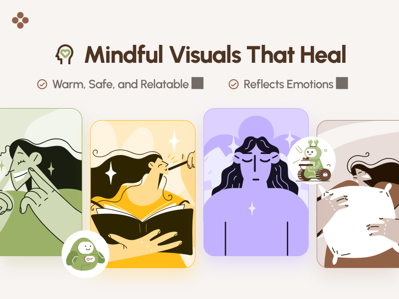
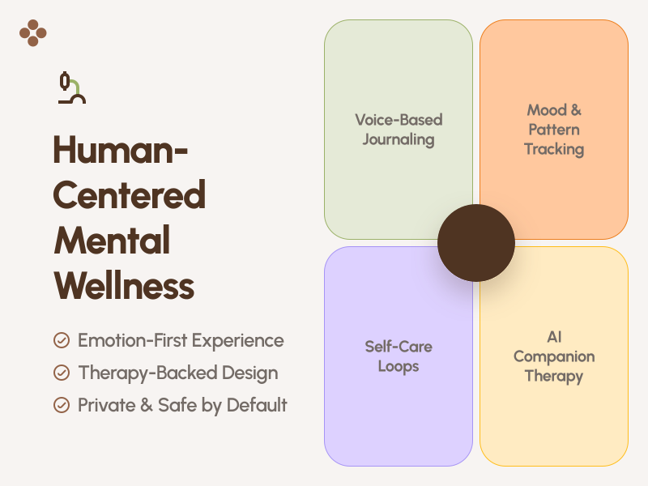

# 🧘‍♀️ Nirvana – Your AI-Powered Mental Wellness Companion

<!-- PROJECT LOGO -->
 

  

  <h3 align="center">Nirvana AI</h3>

  

    Feel Better. Live Brighter. Start with Nirvana.
     
    <a href=""><strong>Explore the docs »</strong></a>
     
     
    <a href="https://github.com/mdkaifansari04/nirvana-ai/issues">Report Bug</a>
    ·
    <a href="https://github.com/mdkaifansari04/nirvana-ai/issues">Request Feature</a>
  

> _"Nirvana isn't just an app — it's a space where your mind can breathe, heal, and grow."_

---

## 🌍 The Problem We’re Solving

In a fast-paced world, mental wellness is often ignored or misunderstood. Many people struggle silently with stress, anxiety, overthinking, and emotional burnout — but hesitate to reach out or find time to care for their mental health. Therapy may not always be accessible, and self-care often takes a back seat.

---

## 💡 What is Nirvana?

**Nirvana** is an AI-powered mental wellness app designed to make emotional care simple, private, and consistent. It's like a pocket therapist, a mood companion, and a daily self-care coach — all in one.

With mindful designs and illustrations, Nirvana helps you reconnect with yourself through calming features that support your emotional well-being.

---

## ✨ Key Features

| Feature                            | Description                                                                |
| ---------------------------------- | -------------------------------------------------------------------------- |
| 🧠 **AI Therapy Chatbot**          | Talk to an emotionally-aware AI trained for gentle CBT-based interactions. |
| 📊 **Mood & Mental State Tracker** | Log how you feel every day and reflect over time.                          |
| 📝 **AI Journaling Assistant**     | Write freely or respond to prompts; AI helps you structure and express.    |
| 📃 **AI-Generated CBT Reports**    | Get personal insights based on mood logs and conversations.                |
| 📈 **Mental Wellness Dashboard**   | Visualize how your mental health evolves.                                  |
| 🎧 **Motivational Audio & Music**  | Listen to curated sounds for focus, calm, or sleep.                        |
| 💬 **Daily Quotes**                | Uplift your day with AI-personalized motivational messages.                |

---

## 🌟 Visual Preview

_Cute & fun style designed to feel emotionally safe and comforting._ 🤗

  
  
  

---

## 🎬 Product Video (Coming Soon)

> _Want a walkthrough?_ A short product demo video will be added here soon.

---

## 🧠 Why Nirvana?

- No signups, no pressure — just healing and reflection.
- Built by people who understand how it feels to be overwhelmed.
- Private, AI-powered, and designed for everyone — students, professionals, creators, and anyone needing mental peace.

---

## 🚀 Let Nirvana Be Your Mental Anchor

Whether it’s midnight anxiety or Monday blues, **Nirvana is here to hold space for your emotions** — every day, in your own way.

---

## 🛠️ Developer Notes

### Current API Architecture

- Frontend + API run in `frontend` (Next.js app router).
- All app API calls are same-origin and routed via `/api/v1/*`.
- Mongoose access and service logic live in `frontend/lib/server/*`.
- `backend/` is still kept in the repo as a reference snapshot until archival sign-off.

### Local Setup

1. Install deps:
   - `cd frontend && bun install`
2. Add envs in `frontend/.env` (copy from `frontend/.env.example`):
   - `MONGO_URL`
   - `GROQ_API_KEY`
   - `NEXT_PUBLIC_CLERK_PUBLISHABLE_KEY` (or `CLERK_PUBLISHABLE_KEY`)
   - `CLERK_SECRET_KEY`
   - `SIGNING_SECRET` (for Clerk webhooks)
3. Start:
   - `bun run dev`

### Verification Commands

- Unit checks:
  - `bun test data-access/__tests__/client.test.ts lib/server/__tests__/foundation.test.ts`
- Full production build:
  - `bun run build:next`
- Optional parity smoke (old backend vs new Next routes):
  - `OLD_API_BASE=http://localhost:5000 NEW_API_BASE=http://localhost:3000 bun run scripts/api-parity-smoke.ts`
